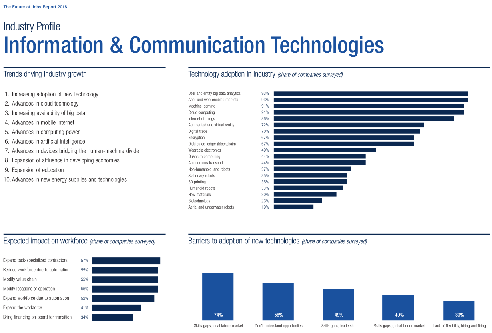

# Notes from Upskilling The Humans of DevOps

## [Minding the Gaps Upskilling "The Humans of DevOps" Video](https://www.youtube.com/watch?v=5tIwKh3t58Y)

### the skills that DevOps practitioners should be improving

Panelists (top to bottom at start):

* Paul Flaharty - District President - Robert Half
* Tapabrata Pal - Distiguished Engineer - Capital One
* Jayne Groll - CEO - DevOps Institute
* Sacha Labourey - CEO - CloudBees
* Sam

10:15 [Jayne] Automation skills were important, but process and soft skills ("human skills") were equally important

10:49 [Jayne] "Need intelligent processes to make automation a success."

11:20 [Jayne] People are self-identifying as operations vs. development. This was not part of the survey. Operations needs to understand the software development lifecycle. Developers need to understand operations and infrastructure.

11:56 [Jayne] "Business skills are most important to leaders [managers]."

12:08 [Jayne] Hiring from within is the most common preference. Only fill from the outside once we find places that cannot be filled internally.

12:40 [Jayne] Top skills needed:

* Critical thinking skills
* Systems thinking skills
* Security skills

(Personal note: the latter two are very closely related. Security can be thought of as simply a specific application of systems thinking skills, provided I understand that to mean "systems" in the [engineering sense](https://en.wikipedia.org/wiki/Systems_engineering) and not in the "computer servers" sense.)

### differences between individual contributors, managers, and C-suite responses

15:17 [Jayne] Management is the group that does the hiring and will have impact on the hiring decision process.

16:20 [Robert] Often searches start out with specific tools mentioned and other soft skills are de-emphasized. The survey results seem to reflect other priorities. "Hire for ability, growth potential, and their ability to learn, collaborate, and communicate effectively vs. checking every box on a particular tool set."

19:28 [Tapabrata] Part of the role of a senior individual contributor is helping to bring up the skills of other, possibly less senior individual contributors throughout the company. It's less about becoming a deep expert over time and more about gaining a breadth of knowledge. Also this role begins to have an increasing need to influence other people, which requires good soft skills.

20:40 [Tapabrata] He looks at job candidates in this priority order:

1. Soft skills
2. Breadth of functional skills
3. Depth of functional skills

22:30 [Sacha] "We all want to hire the unicorn but the reality is... you won't find the unicorn you're looking for. Instead find smart people who are willing to learn and willing to adapt."

23:30 [Sam] Internal candidates already have a lot of company-specific knowledge that simply cannot be hired.

### "t-shaped" skill sets-- broad knowledge in addition to specialty

24:55 [Jayne] Historically we've had IT people think of themselves in terms of a single specialty. ("I'm a software engineer.") Now we want people with good general skills too, not deep specialists.

27:40 [Sam] What does CloudBees do to help people gain breadth in addition to a given specialty?

28:00 [Sacha] Let people follow their curiosity. Change departments, attend conferences. Contributing to Open Source is a good way for developers to help a greater good.

31:15 [Tapabrata] Prefers looking at LinkedIn info and GitHub repos rather than people's resumes.

33:16 [Robert] What does it really mean to be "Full Stack?" A frequent problem with staffing and hiring is that this can mean different things to different people. Show constant personal growth via GitHub on each tier of development. Sometimes clients think they're buying 1 person to do 2-3 jobs as a cost savings.

38:15 [Tapabrata] "Nobody means all the way to the metal when they say Full Stack."

(Personal note: too bad, since that would be really helpful for developers to know things to that level.)

40:10 [Sam] Safe failures are a key to fast learning and broad learning.

### soft skills

43:30 [Paul] Soft skills can tie back to reference checks. For example, asking for a specific person from a specific recent job who could speak to how collaborative or empathetic the candidate was in a given situation (e.g. "tight timeline, release pressure, etc.")

44:38 [Sacha] HBDI (?) personality awareness to help guide team needs. Weighing personality vs. organization and describes likely methods of reacting to a particular situation. Compare normal vs. stressed reactions.

47:00 [Sacha] Individual Contributors can sometimes get away with less advanced soft skills, but managers cannot.

47:50 [Jayne] Easy to assume people will self-develop their soft skills. Self-awareness is helpful, but being aware of how other people best operate is also very useful. "Some people want you to ask about the family, others want to get right to the topic." DevOps institute recent book on cultural resilience.

50:20 [Tapabrata] Managers need different soft skills than individual contibutors, not necessarily more. ICs need to convince people in order to have influence rather than having organizationally-determined forced influence.

### hiring or being hired

Conventions of interest:

* DevOps World (Jenkins): Aug 12-15 2019 in San Francisco CA
* DevOps Enterprise Summit: Oct 2?-30 2019 in Las Vegas NV
* CloudBees Days: (nothing remotely local to western USA)
* Paris Jenkins Area Meetup: (nothing remotely local to western USA)

54:40 [Paul] Better to see what someone has already done (internal) vs. someone who can talk big but might not actually be able to show it. This also reduces the risk of a bad placement. Start with someone who has deep skills in something like development or systems administration and then work on broadening those skills.

57:00 [Jayne] "DevOps Engineer" was the top most hired position despite its poorly defined scope. "DevOps Coach" is also a highly hired position.

### Summary: no real specifics on resources

I came looking for information about resources and methods for self-upskilling. While the discussion was interesting, there was never any specifics about how to gain the skills they talk about.

A good intro-level survey of business soft skills can be found at [Crash Course: Business Soft Skills](https://www.youtube.com/playlist?list=PL8dPuuaLjXtMBsfP-lP28IFvfkISqJofM).

## [Upskilling: Enterprise DevOps Skills Report Results!](https://webinars.devops.com/upskilling-enterprise-devops-skills-report-results)

To view this source two registrations are required. One for the DevOps.com site and one for both LinkedIn.com and Slideshare.net. They will send a confirmation E-mail with a code and will sign you up for endless spam. A disposable E-mail such as Sneakemail.com is highly recommended.

The [Upskilling Enterprise DevOps Skills Report Results!](https://www.youtube.com/watch?v=5kbhyAQUqMA) video is on YouTube so once you have the URL you can also bypass the above registration. The PDF slide download requires the registration.

Some stats were cited from [The Future of Jobs Report 2018](http://www3.weforum.org/docs/WEF_Future_of_Jobs_2018.pdf) which contains quite a lot of information. Understanding the info and how it was collected can help understand the details behind some of this presentation that supports the first presentation. Blockchain? How about citation-chain?

Some of the possibly relevant raw data:

This shows the following "barriers to adoption of new technologies (share of companies surveyed)":

* 74% skills gap, local labor market
* 58% don't understand opportunities
* 49% skills gap, leadership
* 40% skills gap, global labor market
* 30% lack of flexibility, hiring and firing

The combination of skills gaps and inflexible hiring/firing practices appears to support the "resource constraints" summary issue in the *Enterprise DevOps Skills Report Results* report.

### DevOps as an Automator

`Question: How would you rate the importance of the following categories of skills for your DevOps team member?`

Most important:

* Automation skills
* Process skills and knowledge
* Soft skills

Least important:

* Specific certifications
* Business skills
* Specific automation tools

#### Differences Of Perspectives Of "Must-have"

Shows the differences between C-Suite, management, and individual contributors' ratings of "must have" items

* individual contributors rated specific functional knowledge more highly (44%) vs (30-something) for the other categories
* otherwise the C-suite and management rated these other categories as "must-have" more often than ICs
  * Automation skills (high across the board)
  * Specific certifications (low across the board)
  * Business skills (increases with each step from IC -> management -> C-suite)
  * Soft skills (increases with each step from IC -> management -> C-suite)

Highest ranked soft skills:

* Collaboration and cooperation
* Problem solving
* Interpersonal skills

Lowest ranked soft skills:

* Risk taking
* Visionary
* Career development
